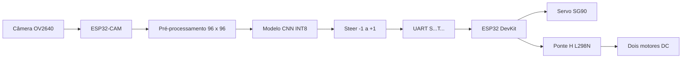

# Carrinho autônomo seguidor de linha com ML

Projeto de um carrinho que aprende a esterçar a partir de imagens da pista. A ESP32-CAM captura a imagem, executa uma rede neural quantizada e envia direção e aceleração por UART para uma ESP32 DevKit, responsável pelo servo e pelos dois motores ligados à ponte H L298N.

## Conteúdo

- [Visão geral](#visão-geral)
- [Hardware](#hardware)
- [Funcionamento etapa a etapa](#funcionamento-etapa-a-etapa)
- [Redes neurais](#redes-neurais)
- [Visão computacional](#visão-computacional)
- [Firmwares](#firmwares)
- [Estrutura do repositório](#estrutura-do-repositório)
- [Dados e arquivos grandes](#dados-e-arquivos-grandes)

## Visão geral



O projeto separa as responsabilidades:

- **ESP32-CAM:** câmera, coleta do dataset e inferência do modelo no modo autônomo.
- **ESP32 DevKit:** recebe `steer` e `throttle`, movimenta o servo e controla os motores.
- **Computador:** processa o dataset, treina, avalia e converte o modelo.
- **Cartão microSD:** armazena imagens e comandos durante a coleta.

## Hardware

- ESP32-CAM AI Thinker com câmera OV2640;
- ESP32 DevKit V1;
- ponte H L298N;
- dois motores DC 3–6 V com caixa de redução;
- microservo SG90;
- duas baterias 18650 em série para os motores;
- LM2596 ajustado para 5 V para os dois ESP32 e o servo;
- cartão microSD para coleta do dataset.

Os dois ESP32 se comunicam por UART. O protocolo é uma linha no formato `S<steer>T<throttle>`, com valores normalizados de `-1` a `+1`. Consulte a ligação completa em [PINAGEM.md](PINAGEM.md).

## Funcionamento etapa a etapa

### 1. Montagem e controle dos atuadores

Grave `firmware/esp32_motor_controller` na ESP32 DevKit. Esse firmware converte o comando de direção em ângulo do servo e o acelerador em PWM para a L298N. Ele também possui um watchdog: se os comandos válidos deixarem de chegar, os motores são desligados.

### 2. Coleta manual do dataset

Grave `firmware/esp32cam_server` na ESP32-CAM. Copie `wifi_config.example.h` para `wifi_config.h` e preencha a rede local. A página de controle envia os comandos do joystick por WebSocket, enquanto a placa encaminha esses comandos ao controlador de motores.

Ao iniciar a gravação, a ESP32-CAM cria uma sessão no cartão SD contendo:

- imagens `frame_XXXXX.jpg` em QVGA, 320 × 240;
- arquivo `log.csv` com imagem, direção, aceleração e timestamps;
- informação sobre a validade e a idade do comando associado ao frame.

Use sessões diferentes para variar sentido da volta, posição inicial, iluminação, velocidade, retas e curvas. A separação posterior é feita por sessão, portanto uma gravação inteira permanece em apenas um conjunto.

### 3. Coleta opcional com piloto professor

`firmware/esp32cam_teacher_recorder` oferece um piloto independente baseado em visão clássica. Ele estima a faixa por contraste e geometria e pode gerar demonstrações automaticamente. Esse modo não usa a rede neural e deve ser validado na pista antes de produzir dados de treinamento.

### 4. Análise dos dados

Copie as sessões do cartão para uma pasta local `imagens_treino*` e execute:

```powershell
py .\ml_pipeline\01_analisar_dataset.py
```

O relatório mostra a distribuição de direção, aceleração e exemplos de imagens. Verifique especialmente o equilíbrio entre esquerda, reta e direita, além da diversidade de iluminação e pista.

### 5. Pré-processamento

```powershell
py .\ml_pipeline\02_preprocessar.py --raw-dir .\imagens_treino --output-dir .\dataset_processado_novo
```

O pipeline valida os registros, separa sessões inteiras em treino, validação e teste e gera os arrays NumPy. Somente o treino recebe aumento de dados. Use `--require-aligned` quando quiser aceitar apenas amostras cuja associação entre imagem e comando foi comprovada.

### 6. Treinamento

```powershell
py .\ml_pipeline\03_treinar_modelo.py --dataset-dir .\dataset_processado_novo --model-dir .\modelo_novo
```

O treinamento usa o conjunto de validação para escolher o melhor checkpoint. As configurações principais ficam em `ml_pipeline/config.py`. Sempre use um diretório novo para não substituir um modelo anterior.

### 7. Conversão para TensorFlow Lite Micro

```powershell
py .\ml_pipeline\04_converter_tflite.py --dataset-dir .\dataset_processado_novo --model-dir .\modelo_novo
```

A conversão produz um modelo INT8 e o header C++ `modelo_linha.h`. A calibração da quantização usa somente amostras de treino.

### 8. Avaliação

Durante os ajustes, consulte a validação:

```powershell
py .\ml_pipeline\avaliar_precisao.py --split val --dataset-dir .\dataset_processado_novo --model-dir .\modelo_novo
```

Use o teste reservado apenas para a avaliação final. Observe MAE, MSE, R², percentil 95 do erro, acerto do lado das curvas e resultados separados por direção e sessão. Acertar o lado não garante que a intensidade do esterçamento seja suficiente.

### 9. Instalação do modelo

Depois de aprovar o modelo INT8, copie o header gerado para:

```text
firmware/esp32cam_autonomous/modelo_linha.h
```

Grave `firmware/esp32cam_autonomous` somente na ESP32-CAM. A ESP32 DevKit não precisa ser atualizada quando o protocolo permanece o mesmo.

### 10. Execução autônoma

A ESP32-CAM captura o frame, reproduz o pré-processamento do treino, executa a CNN e envia o comando atual à ESP32 DevKit. O firmware vigente usa diretamente a direção prevista pelo modelo; não executa busca, ré ou recuperação heurística da linha.

Antes de aumentar a velocidade, valide retas, curvas para os dois lados e diferentes iluminações com as rodas suspensas e depois em baixa velocidade.

## Redes neurais

### Problema aprendido

O treinamento é uma **regressão supervisionada por imitação**. Cada imagem é associada ao comando humano de direção:

- `-1`: esterçamento máximo para a esquerda;
- `0`: direção central;
- `+1`: esterçamento máximo para a direita.

A rede aprende apenas `steer`. O firmware calcula o `throttle` a partir da intensidade da curva e das configurações de velocidade.

### Arquitetura atual

A entrada possui `96 × 96 × 1` pixels em escala de cinza. A CNN contém:

1. convolução com 4 filtros 5 × 5 e stride 4;
2. convolução com 8 filtros 3 × 3 e stride 2;
3. convolução com 12 filtros 3 × 3 e stride 2;
4. `GlobalAveragePooling2D`;
5. camada densa com 16 neurônios e ReLU;
6. saída única com `tanh`, limitada entre `-1` e `+1`.

O modelo usa Adam, perda MSE e acompanha MAE. `ModelCheckpoint` preserva a menor perda de validação, `EarlyStopping` interrompe épocas sem melhoria e `ReduceLROnPlateau` reduz a taxa de aprendizado quando necessário.

### Separação e vazamento de dados

As sessões são separadas antes do aumento de dados. Isso evita que frames quase idênticos da mesma volta apareçam simultaneamente em treino e validação. Flip horizontal e variação de brilho/contraste são aplicados somente no treino; ao espelhar a imagem, o sinal do `steer` também é invertido.

### Quantização e execução embarcada

O modelo Keras é convertido para INT8 para caber e executar com menor latência na ESP32-CAM. O firmware usa TensorFlow Lite Micro e convoluções ESP-NN otimizadas. Na inicialização, as convoluções otimizadas são comparadas com a implementação de referência antes de o movimento ser habilitado.

O pré-processamento escreve diretamente no tensor INT8, e o firmware tenta manter arena, tabelas e modelo em memória interna para melhorar a localidade. Essas otimizações reduzem latência, mas não corrigem erros causados por dados insuficientes ou mudança de iluminação.

### Limitações importantes

- Métricas offline boas não garantem estabilidade com o carrinho em movimento.
- `direction_accuracy` mede o lado, não a intensidade correta da curva.
- Iluminação, reflexos, textura do piso, altura e inclinação da câmera alteram a distribuição das imagens.
- Se curvas de um lado forem gravadas em uma condição visual específica, a rede pode aprender essa correlação indesejada.
- Para corrigir uma condição nova, colete exemplos reais dela e mantenha sessões independentes para validação e teste.

## Visão computacional

O projeto utiliza visão computacional de duas formas diferentes.

### Processamento usado pela rede neural

No modo autônomo, a OV2640 captura imagens QVGA em escala de cinza. O firmware reduz a imagem para 96 × 96 usando a mesma média inteira 2 × 2 empregada pelo pipeline, normaliza os pixels e os quantiza para INT8. Manter o mesmo processamento no computador e na placa evita diferença entre treinamento e inferência.

A CNN recebe os pixels processados e aprende sozinha os padrões relevantes. Não há uma regra explícita dizendo onde está a linha; essa representação é aprendida a partir dos exemplos e comandos.

### Visão clássica do piloto professor

O piloto professor analisa contraste, segmentos escuros, continuidade vertical e posição da faixa em várias regiões da imagem. A partir da geometria observada, calcula erro lateral e curvatura para um controlador PD.

Essa abordagem é interpretável e não precisa de treinamento, mas depende de limiares e pode falhar com sombras, reflexos, bifurcações, cruzamentos ou quando a linha sai do campo da câmera. Ela é uma ferramenta separada para coleta e comparação, não participa do piloto ML atual.

### Iluminação e câmera

Mais luz não significa automaticamente uma imagem melhor. Exposição automática, brilho do piso e reflexos podem diminuir o contraste ou produzir uma aparência diferente daquela vista no treino. Para maior robustez:

- grave todos os tipos de direção em condições variadas;
- evite associar apenas curvas direitas a um local escuro e curvas esquerdas a um local claro;
- mantenha posição, foco e inclinação da câmera consistentes;
- inclua na coleta as condições reais da pista de teste;
- compare amostras antes e depois do pré-processamento.

## Firmwares

| Pasta | Placa | Finalidade |
|---|---|---|
| `firmware/esp32_motor_controller` | ESP32 DevKit | Servo, motores, PWM, protocolo UART e failsafe |
| `firmware/esp32cam_server` | ESP32-CAM | Controle manual via Wi-Fi, stream e gravação no SD |
| `firmware/esp32cam_teacher_recorder` | ESP32-CAM | Coleta automática com visão clássica |
| `firmware/esp32cam_autonomous` | ESP32-CAM | Inferência CNN INT8 e pilotagem autônoma |

## Estrutura do repositório

```text
firmware/                 Código das duas placas
interface_controle/       Interface web do controle manual
ml_pipeline/              Análise, processamento, treino, conversão e avaliação
tests/                    Testes do protocolo, pipeline e otimizações
PINAGEM.md                Ligações elétricas e pinos
IMPLEMENTACAO_ML.md       Histórico técnico das alterações
```

Os detalhes do pipeline estão em [ml_pipeline/README.md](ml_pipeline/README.md), e as instruções de gravação do piloto em [firmware/esp32cam_autonomous/COMO_GRAVAR_ARDUINO.md](firmware/esp32cam_autonomous/COMO_GRAVAR_ARDUINO.md).

## Dados e arquivos grandes

Datasets, arrays processados, modelos de treinamento, gráficos e backups compactados são ignorados pelo Git. O repositório mantém o código e o header do modelo instalado no firmware.

Para compartilhar os dados, use Google Drive para uma transferência simples ou Hugging Face Datasets/Zenodo quando precisar de versão, descrição e referência pública. Registre no README o link, a versão do dataset, o hash do arquivo e a divisão de sessões utilizada no treinamento.

As credenciais Wi-Fi também não são versionadas. Em uma cópia nova do projeto, duplique `firmware/esp32cam_server/wifi_config.example.h` como `wifi_config.h` e preencha os valores localmente.
